# StellarPact — On-Chain Milestone Escrow with Reputation

[](https://stellar-pact-pi.vercel.app)
[](https://github.com/Madhur-Prakash/Stellar-Pact/actions/workflows/ci.yml)
[](contracts/)
[](https://stellar.expert/explorer/testnet/contract/CDF6NQL6ZDLI5B6WYVVDKR6PTOMCXPQHFHCBS5Y5DWQDFGPL4EMVRK3N)
[](#testing)
[](LICENSE)

Freelance work, settled by contract instead of by trust. A client locks XLM into
an escrow that exists for one deal and nothing else, releases it milestone by
milestone as work lands, and every completed deal writes a permanent reputation
record for the worker that **nobody — including the worker — can forge**.

<p align="center">
  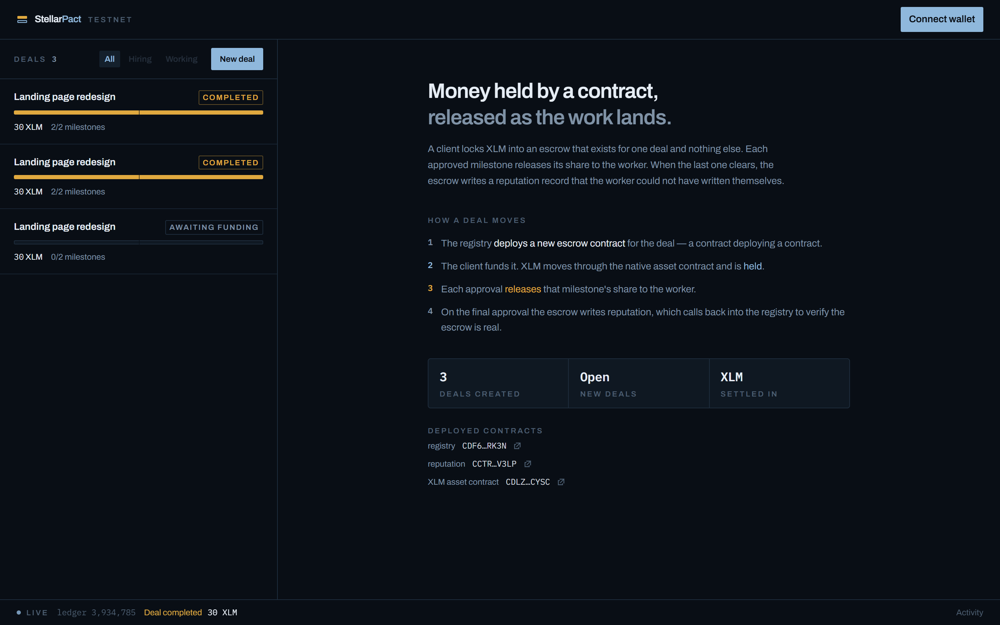
</p>

---

## Submission

| | |
|---|---|
| **Live demo** | **https://stellar-pact-pi.vercel.app** — live on Stellar testnet |
| **Repository** | https://github.com/Madhur-Prakash/Stellar-Pact |
| **Registry contract** | [`CDF6NQL6ZDLI5B6WYVVDKR6PTOMCXPQHFHCBS5Y5DWQDFGPL4EMVRK3N`](https://stellar.expert/explorer/testnet/contract/CDF6NQL6ZDLI5B6WYVVDKR6PTOMCXPQHFHCBS5Y5DWQDFGPL4EMVRK3N) |
| **Reputation contract** | [`CCTRF56HY5G7HNGQZUUWEKX7OI7NYO55PR3XIU4ZZCCJ3CKUXSZIV3LP`](https://stellar.expert/explorer/testnet/contract/CCTRF56HY5G7HNGQZUUWEKX7OI7NYO55PR3XIU4ZZCCJ3CKUXSZIV3LP) |
| **Escrow WASM hash** | `db54dbf7bbb912c7c04a8b22215f01ce811ffa1acc3cc57b37d87255b6249743` |
| **Example contract call** | [`5304d3ae…` — final approval, settles the deal and writes reputation](https://stellar.expert/explorer/testnet/tx/5304d3aec519b36fd596a38a6a7c1c5e7430a53966facd6ec7bec52071407e52) |
| **Demo video** | **https://youtu.be/YErtSWpK8J8** — 1:42, 1080p, narrated |
| **Tests** | 133 passing (47 contract, 86 frontend) — [contract output](docs/screenshots/10-test-contracts.png) · [frontend output](docs/screenshots/11-test-frontend.png) |
| **CI** | [`ci.yml`](.github/workflows/ci.yml) — [run detail](docs/screenshots/09-ci-running.png) · [checks passed](docs/screenshots/08-ci-pipeline.png) |
| **Network** | Stellar testnet |

---

## Demo

<p align="center">
  <a href="https://youtu.be/YErtSWpK8J8">
    
  </a>
  <br>
  <strong><a href="https://youtu.be/YErtSWpK8J8">▶ Watch the 1:42 demo on YouTube</a></strong> — narrated, 1080p
</p>

It opens on the problem, shows the product running on testnet, and spends its middle on the two
things a single contract cannot do: deploying a fresh escrow per deal, and writing a reputation
record its own subject cannot forge.

| | |
|---|---|
| Full cut | **[youtu.be/YErtSWpK8J8](https://youtu.be/YErtSWpK8J8)** — 1920×1080, 1:42 |
| Vertical cut | [`stellarpact-vertical-9x16.mp4`](docs/demo/stellarpact-vertical-9x16.mp4) — 1080×1920, 0:38 |
| Poster / OG card | [`poster.png`](docs/demo/poster.png) · [`og-card.png`](docs/demo/og-card.png) |

Two stills from the middle of it — the signature value bar, and the cross-contract call graph:

| Ice is held, gold is released | Escrow → reputation → registry |
|---|---|
| 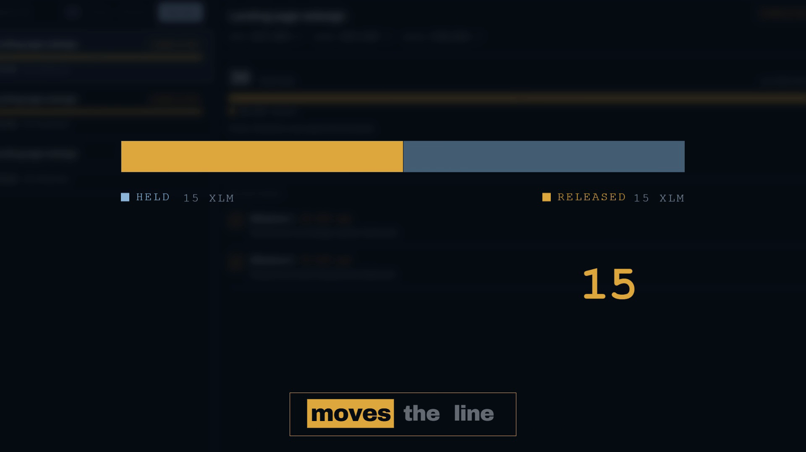 | 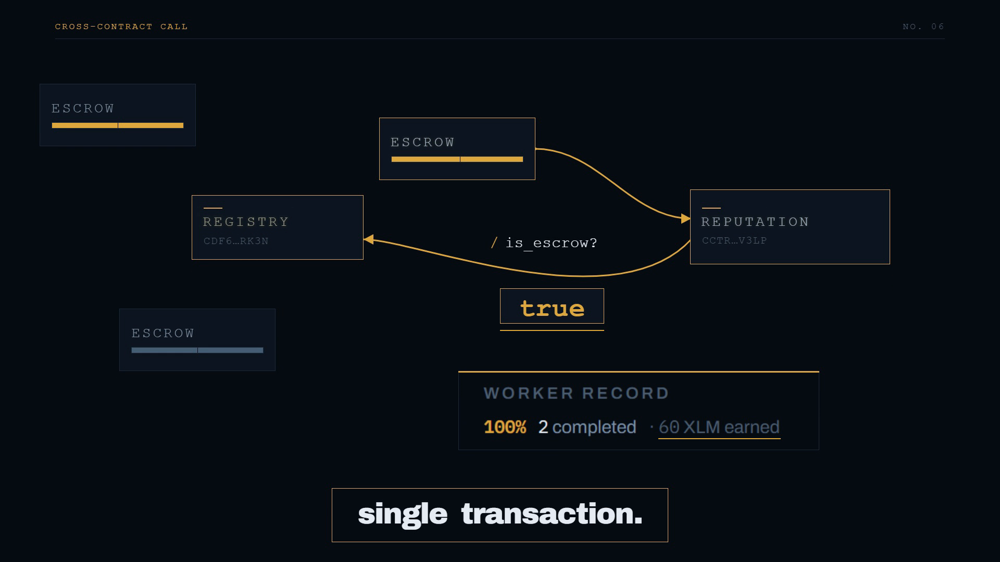 |

---

## Why three contracts

Escrow is one of the few product shapes where multi-contract architecture is not
decoration — a single contract genuinely cannot do the job safely.

```
                    ┌───────────────────┐
  create_deal ─────▶│ RegistryContract  │──── deploy_v2() ──▶ a fresh
                    │ (factory + index) │                     EscrowContract,
                    └─────────┬─────────┘                     one per deal
                              │ is_escrow(addr)? ◀──────────────────┐
                              ▼                                     │
  fund() ───────────▶┌───────────────────┐                          │
  submit_milestone()▶│  EscrowContract   │── transfer() ──▶ SAC (native XLM)
  approve_milestone()│  (per-deal state) │                          │
  refund() ─────────▶└─────────┬─────────┘                          │
                               │ record(self, worker, amt, ok)      │
                               ▼                                    │
                    ┌───────────────────┐                           │
                    │ReputationContract │───── verifies caller ─────┘
                    └───────────────────┘
```

**Funds are isolated.** Each deal gets its own contract instance, so a bug or a
dispute in one deal cannot reach another deal's balance. The escrow's address
*is* the deal's identity on-chain.

**Reputation cannot be forged.** `record` refuses every caller except an escrow
the registry actually deployed — and it does not take the caller's word for it,
it calls back into the registry to check. An attacker who deploys byte-identical
escrow code and runs it to completion is still refused, and because the write
fails, the payout bundled with it rolls back too. [That is a test.](#the-security-property-proven)

**Authority is centralised but not duplicated.** Escrows don't store an admin
address; they ask the registry at call time. Rotating the admin there immediately
changes who can settle disputes in every escrow ever deployed.

### The four cross-contract hops

| From | To | When |
|---|---|---|
| Registry | *new* Escrow | `create_deal` — `deploy_v2` with constructor args |
| Escrow | SAC (native XLM) | `fund`, `approve_milestone`, `refund`, `resolve_dispute` |
| Escrow | Reputation | on completion, refund, or dispute resolution |
| Reputation | Registry | inside every `record`, to verify the caller |

The last two chain: **Escrow → Reputation → Registry is a genuine two-hop call
in a single invocation.**

---

## Deal lifecycle

```
  Pending ──fund()──▶ Active ──approve × n──▶ Completed
                        │
                        ├── refund()  (after deadline) ──▶ Refunded
                        └── raise_dispute() ──▶ Disputed ──resolve──▶ Completed
                                                                    / Refunded
```

Milestones split the total evenly; the final one absorbs the integer-division
remainder, so the escrow always drains to **exactly zero stroops** rather than
stranding dust forever.

---

## Screenshots

### Deal detail — milestone timeline and worker record
Real on-chain data: submission notes, per-milestone payouts, and a reputation
record read from the reputation contract.

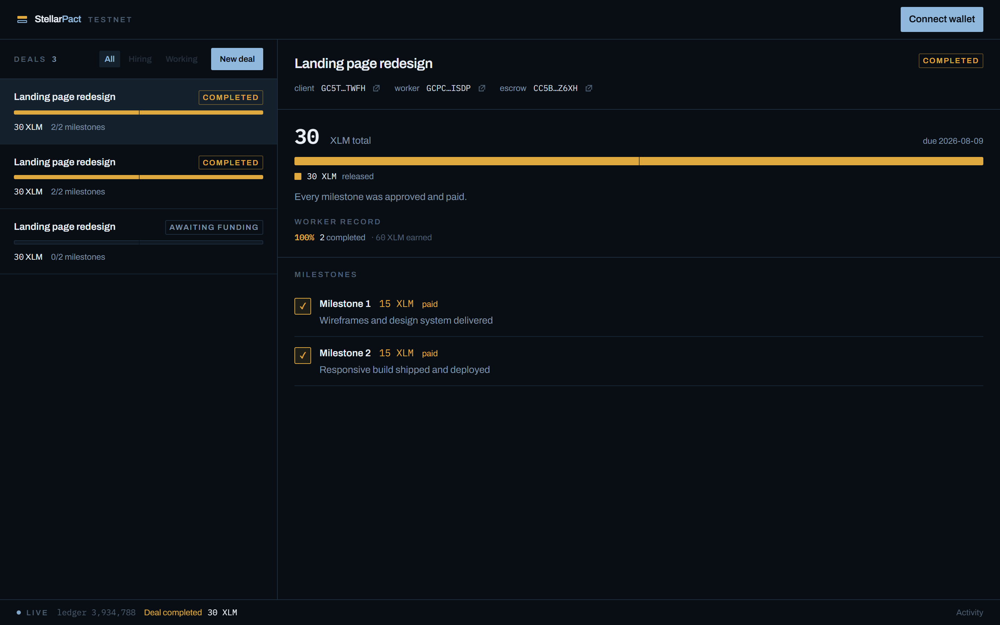

### Live activity — contract events streamed from the chain
One RPC filter on the shared `pact` topic subscribes to all three contracts,
including escrows that did not exist when the page loaded.

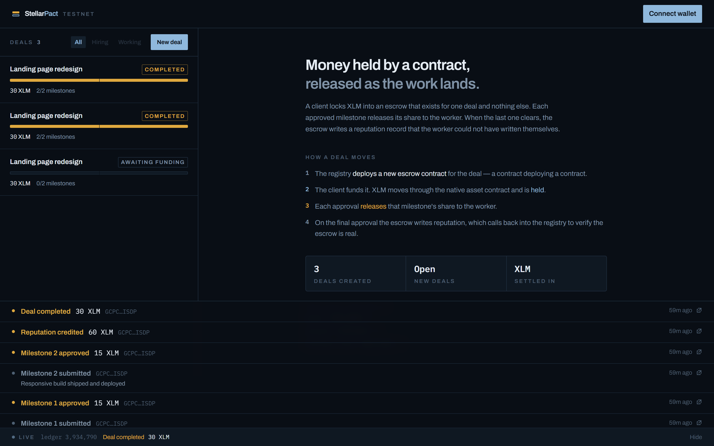

### Wallet options
Six wallets via StellarWalletsKit, with install links for any that are missing.

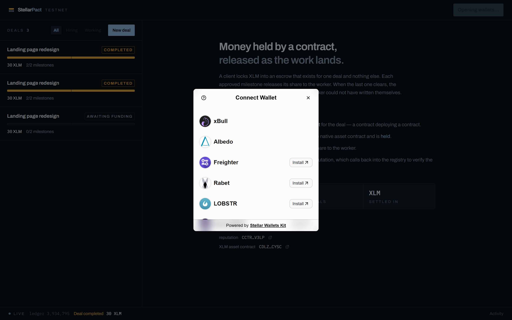

### Creating a deal
Every rule the contract enforces is checked here first, so an invalid deal never
reaches a wallet prompt.

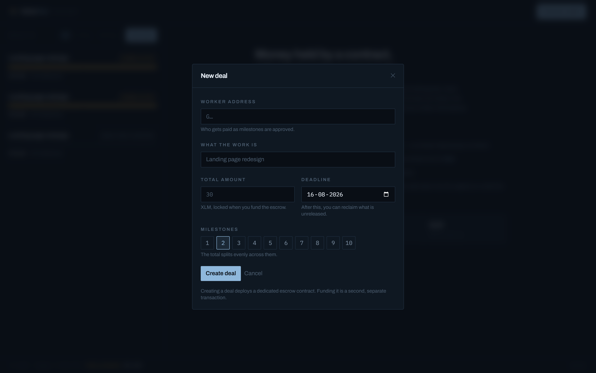

### Mobile

| Deals | Detail |
|---|---|
| 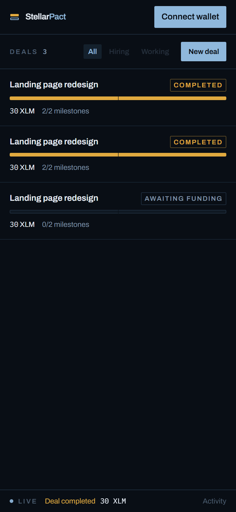 | 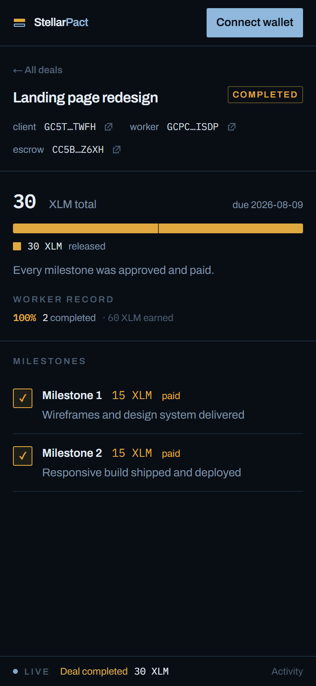 |

---

## Design

The palette carries meaning rather than mood. Every amount on screen is either
money still frozen in a contract or money that has already moved, so the two
states get their own colour — **ice for held, gold for released** — and a third
accent is reserved for the paths where a deal went wrong. Rust appearing anywhere
means something is genuinely off.

That idea is spent in full on one element: the **value bar**. Gold fills from the
left as milestones clear, ice shows what is still locked, and hairlines mark the
milestone boundaries — so the bar is the payment schedule *and* the progress
against it at once. Each segment's width is literally what that milestone is
worth. It is also the only animated element in the app.

Every exact on-chain quantity — amounts, addresses, hashes, ledger numbers — sets
in IBM Plex Mono, so anything that came off the chain looks like it. Interface
text sets in Archivo.

---

## Tech stack

| Layer | Choice |
|---|---|
| Contracts | Rust + `soroban-sdk` 27, `wasm32v1-none` |
| Frontend | Next.js 16 (App Router, Turbopack) + React 19 + TypeScript |
| Styling | Tailwind CSS v4 |
| Chain access | `@stellar/stellar-sdk` 16 — Soroban RPC + Horizon |
| Wallets | `@creit.tech/stellar-wallets-kit` 2.5 |
| Tests | `cargo test` + Vitest / Testing Library / jsdom |
| CI | GitHub Actions |

---

## Project structure

```
contracts/
  registry/       factory, escrow index, admin surface
  escrow/         one deal: funding, milestones, refunds, disputes
  reputation/     write-restricted worker reputation ledger
  integration/    end-to-end tests against the compiled .wasm
frontend/
  src/lib/        config, formatting, errors, RPC, contracts, events
  src/hooks/      data loading and the shared write pipeline
  src/context/    wallet and toast providers
  src/components/ dashboard, value bar, activity tape
scripts/
  deploy.sh            build, upload, deploy, wire, and sync addresses repo-wide
  demo.sh              drive one deal end-to-end, recording every tx hash
  sync-addresses.mjs   propagate a deployment into every file that hardcodes it
deployments/
  testnet.json    the addresses everything else reads from
docs/
  architecture.md, contracts.md, demo-video.md
```

---

## Quick start

Node.js 22+ is all you need to run the app. Rust and the Stellar CLI are only
required to build or deploy the contracts — see
[Deploying the contracts](#deploying-the-contracts).

### Run the frontend against the live deployment

Nothing to deploy — the committed example already points at the contracts in the
table above.

```sh
git clone https://github.com/Madhur-Prakash/Stellar-Pact.git
cd Stellar-Pact/frontend
cp .env.example .env.local
npm install
npm run dev
```

Open http://localhost:3000. To take actions you will need a testnet wallet with
XLM — connect a wallet, then fund it from [friendbot](https://friendbot.stellar.org).

---

## Deploying the contracts

The contracts in the [Submission](#submission) table are **already live on
testnet** — you only need this section to run your own deployment.

### Prerequisites

```sh
rustup target add wasm32v1-none
cargo install --locked stellar-cli --features opt
```

No funded account is needed. The script creates a deployer identity and funds it
from friendbot.

### One command

```sh
bash scripts/deploy.sh
```

Roughly two minutes. Deploy elsewhere with `NETWORK=futurenet bash scripts/deploy.sh`,
or use a different identity with `IDENTITY=my-key bash scripts/deploy.sh`.

### What it does, and why the order is fixed

The deployment has a genuine dependency cycle: the registry cannot be
constructed without the reputation contract's address, but the reputation
contract will not accept a single write until it knows the registry's address.
The script breaks it in seven steps.

| # | Step | Why |
|---|---|---|
| 1 | Create or reuse the `pact-deployer` identity | becomes the admin |
| 2 | Fund it from friendbot | pays transaction fees |
| 3 | `stellar contract build` | compiles all three contracts to WASM |
| 4 | **Upload** `escrow.wasm`, keep the hash | the escrow is uploaded but never deployed by hand — the registry mints instances from this hash |
| 5 | Deploy **reputation** with only an admin | the registry does not exist yet |
| 6 | Deploy **registry** with the WASM hash, the reputation address and the native XLM SAC | it now has everything it needs |
| 7 | `reputation.set_registry(registry)` | **closes the cycle** — admin-only, one-time, refuses a second call |

It writes two files, both generated — never edit them by hand:

- `deployments/<network>.json` — the source of truth for every address
- `frontend/.env.local` — read by the app at build time

…and then, as its last step, propagates those addresses into the four files
that hardcode them: `frontend/.env.example`, both env blocks in
`.github/workflows/ci.yml`, this README, and `docs/contracts.md`. **A redeploy
therefore needs no manual edits anywhere.**

That step exists because the failure it prevents is silent: a stale address
breaks nothing, since the previously deployed contracts keep working, so the
docs would simply describe a deployment that is no longer current. Run it
standalone if you ever deploy by hand, or check for drift without writing:

```sh
node scripts/sync-addresses.mjs --network testnet   # rewrite
node scripts/sync-addresses.mjs --check             # report only, non-zero on drift
```

CI runs `--check` on every push, so drift cannot reach `main` unnoticed.

### Verify the deployment

```sh
bash scripts/demo.sh
```

Creates a real 30 XLM two-milestone deal, funds it, submits and approves both
milestones, then reads the result back off the chain. It prints a transaction
hash for every step and writes `deployments/<network>-demo.json`. A sound
deployment ends with the escrow holding `0` stroops and the worker's reputation
credited.

### Where the keys live

The scripts set `XDG_CONFIG_HOME` to `./.config`, so the Stellar CLI keeps
identities **inside this project** rather than in your home directory:

```
.config/stellar/identity/pact-deployer.toml
```

A checkout therefore carries its own deployer, and nothing is written to a shared
machine account. `.config/` is gitignored, along with a `**/identity/*.toml`
catch-all.

> ⚠️ **That file contains the admin's 24-word seed phrase in plaintext.** A
> gitignore stops git — it does not stop a zip, a cloud-sync folder, or a
> screen-share. Back it up somewhere safe and keep it out of anything you
> distribute. Whoever holds it can pause the registry, rotate the admin away from
> you, and settle every dispute in every escrow you have deployed. There is no
> recovery path.

To use your machine's normal global config instead, set the variable yourself:

```sh
XDG_CONFIG_HOME="$HOME/.config" bash scripts/deploy.sh
```

Inspect the project-local identities at any time:

```sh
XDG_CONFIG_HOME="$PWD/.config" stellar keys ls
XDG_CONFIG_HOME="$PWD/.config" stellar keys address pact-deployer
```

### Changing a contract

Run the tests first — `cd contracts && cargo test` — or you will deploy something
broken.

**Escrow only?** No redeploy needed. Upload the new code and repoint the factory:

```sh
cd contracts && stellar contract build
stellar contract upload --wasm target/wasm32v1-none/release/escrow.wasm \
  --source-account pact-deployer --network testnet          # prints the new hash

stellar contract invoke --id <REGISTRY_ID> --source-account pact-deployer \
  --network testnet -- set_escrow_wasm --escrow_wasm <NEW_HASH>
```

New deals use the new code; escrows already deployed keep running the old code.
That is deliberate — funds already locked must never change behaviour underneath
the people who locked them.

**Registry or reputation?** Re-run `scripts/deploy.sh` for a clean deployment,
then update the addresses in this README and in `frontend/.env.example`.

### Admin operations

```sh
# Stop new deals (escrows already deployed keep working)
stellar contract invoke --id <REGISTRY_ID> --source-account pact-deployer \
  --network testnet -- set_paused --paused true

# Hand the admin role to another account
stellar contract invoke --id <REGISTRY_ID> --source-account pact-deployer \
  --network testnet -- set_admin --new_admin <G...>

# Settle a frozen deal, paying the worker
stellar contract invoke --id <ESCROW_ID> --source-account pact-deployer \
  --network testnet -- resolve_dispute --pay_worker true
```

### When it goes wrong

| Symptom | Cause | Fix |
|---|---|---|
| `wasm32v1-none` target not found | target not installed | `rustup target add wasm32v1-none` |
| `account not found` | friendbot did not fund the deployer | `stellar keys fund pact-deployer --network testnet` |
| `AlreadyWired` at step 7 | reputation is already pointed at a registry | expected when re-running against an existing reputation contract — deploy a fresh one |
| App shows the setup screen | `frontend/.env.local` missing or stale | re-run `scripts/deploy.sh`, or `cp frontend/.env.example frontend/.env.local` |
| `txINSUFFICIENT_BALANCE` in the UI | the connected wallet has no XLM | fund it at [friendbot](https://friendbot.stellar.org) |
| `A local config was found … no longer read` | CLI 27 notice about implicit local config | harmless — the scripts pass the path explicitly |

---

## Testing

```sh
# Contracts — 47 tests. Unit suites need no build artifacts.
cd contracts
cargo test

# The end-to-end suite runs against real WASM, so build first.
cargo build --release --target wasm32v1-none -p registry -p escrow -p reputation
cargo test -p integration

# Frontend — 86 tests.
cd ../frontend
npm run test:run
```

| Suite | Tests | Covers |
|---|---|---|
| `reputation` | 8 | forged-write rejection, score maths, one-time wiring |
| `registry` | 12 | deal validation, pause breaker, admin rotation, paging |
| `escrow` | 19 | full lifecycle, rounding, refunds, disputes, auth boundaries |
| `integration` | 8 | real `deploy_v2`, cross-contract auth, fund isolation, rollback |
| frontend | 86 | value maths, error mapping, deal rules, event decoding, value bar, config |
| **Total** | **133** | |

```
running 19 tests ... test result: ok. 19 passed; 0 failed
running  8 tests ... test result: ok.  8 passed; 0 failed
running 12 tests ... test result: ok. 12 passed; 0 failed
running  8 tests ... test result: ok.  8 passed; 0 failed

 Test Files  7 passed (7)
      Tests  86 passed (86)
```

<p align="center">
  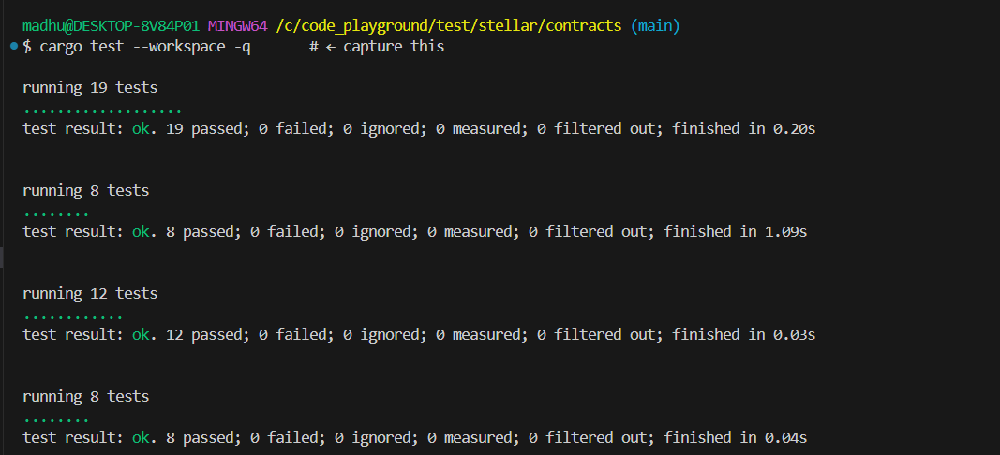
  <br><em><code>cargo test --workspace</code> — 19 + 8 + 12 + 8 = 47 passing, 0 failed</em>
</p>

<p align="center">
  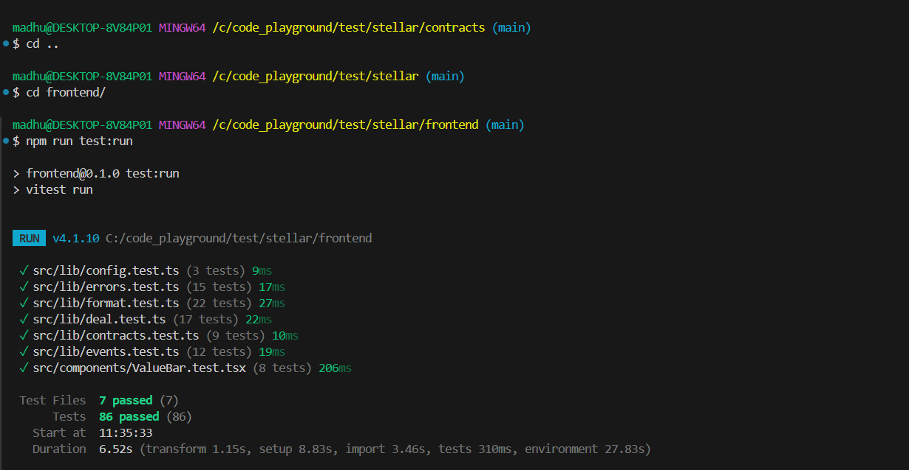
  <br><em><code>npm run test:run</code> — 7 files, 86 passing</em>
</p>

### The security property, proven

`an_escrow_the_registry_never_deployed_cannot_write_reputation` deploys
**byte-identical escrow code** outside the factory, funds it, and runs it to
completion. The reputation write is refused — and because it fails, the XLM
payout bundled with it rolls back. Nothing moved.

That single test is the argument for why three contracts exist.

### Notable cases

- `expectedShare` is checked to sum to the exact total for five awkward amounts
  across one to ten milestones — 50 combinations proving an escrow always drains
  to zero.
- `toStroops` refuses an eighth decimal place rather than rounding it; rounding
  would move an amount the user never agreed to.
- `describeError` is pinned on the case that motivated it: contract code `4` is
  *"not submitted"* in the escrow and *"invalid amount"* in reputation.

---

## CI/CD

[`.github/workflows/ci.yml`](.github/workflows/ci.yml) runs two jobs in parallel
on every push and pull request, with concurrency cancellation and dependency
caching.

| Contracts | Frontend |
|---|---|
| `cargo fmt --check` | `eslint .` |
| build to `wasm32v1-none` | `tsc --noEmit` |
| `cargo clippy -D warnings` | `vitest run` |
| `cargo test --workspace` (47) | `next build` |
| upload WASM artifacts | |

Two details worth noting. The contracts job **builds before it lints or tests**,
because the integration crate imports the compiled `.wasm` at macro-expansion
time and cannot compile until it exists — getting that order wrong passes locally
and fails on a clean checkout. And the WASM is built with plain `cargo` rather
than the Stellar CLI: the contract spec is emitted during compilation, so
installing the CLI would only add minutes to every run.

Lint and type-check are separate frontend steps because Next.js 16 removed
linting from `next build`.

<p align="center">
  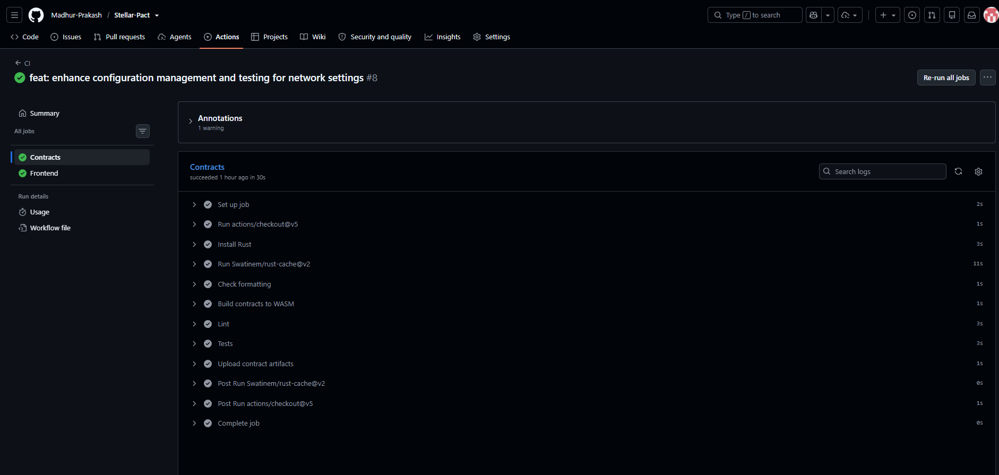
  <br><em>Every step of the contracts job — <code>cargo fmt</code> through artifact upload — with the frontend job green alongside it</em>
</p>

<p align="center">
  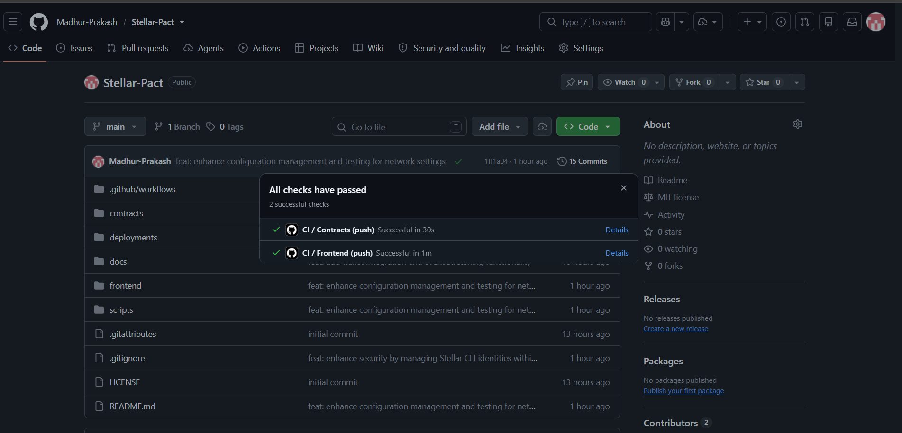
  <br><em>Both checks reported back on the commit</em>
</p>

---

## Error handling

Every failure a user can reach is translated into something they can act on.
Contract errors arrive as `Error(Contract, #N)`, where `N` only means something
alongside the contract that raised it — so callers say which contract they were
talking to and all 22 codes are mapped.

| Category | Example | What the user sees |
|---|---|---|
| Wallet missing | extension not installed | "Install the wallet extension, unlock it, then connect again." |
| Signature declined | user rejects the prompt | "Nothing was submitted." |
| Account unfunded | Horizon 404 | "Fund it from friendbot first." — with a link |
| Insufficient balance | `txINSUFFICIENT_BALANCE` | "Your balance will not cover this amount plus the network fee." |
| Not authorized | escrow `#7`, `#8` | "Only the client or the worker can raise a dispute." |
| Wrong state | escrow `#1` | "Someone changed the deal since this page loaded." |
| Too early | escrow `#6` | "A refund is only possible once the deadline is behind you." |
| Validation | registry `#3`–`#7` | caught before a wallet prompt is ever shown |
| Network | RPC timeout | "The Soroban RPC is unreachable or slow." |

Transaction progress is reported by stage — **Simulate → Sign → Submit →
Confirm** — because signing is the step that waits on a human and simulation is
the step that usually fails. Naming them separately turns "it's stuck" into "your
wallet is waiting".

---

## Deploying the frontend

The app is **already deployed at https://stellar-pact-pi.vercel.app** — you only
need this section to run your own.

The app is a static Next.js build; any host works. On Vercel, set the **root
directory to `frontend`** — the repository root is a Cargo workspace, so the
build fails to find a Next app without it — then add the five required
`NEXT_PUBLIC_*` variables from [`frontend/.env.example`](frontend/.env.example).

```sh
npm i -g vercel
cd frontend && vercel --prod
```

Two things about those variables. They are inlined at **build** time, so adding
one to an existing project does nothing until you redeploy — a site showing the
"StellarPact does not know where its contracts are" screen is almost always
this. And paste the passphrase raw: quoting it would embed the quote characters
into the string, and a wrong passphrase makes the network reject every
signature.

None of them are secret; every `NEXT_PUBLIC_*` value ships to the browser by
design. The admin key is never involved.

**After redeploying the contracts,** exactly two of them change —
`NEXT_PUBLIC_REGISTRY_ID` and `NEXT_PUBLIC_REPUTATION_ID` — and the host needs a
rebuild to pick them up. `scripts/sync-addresses.mjs` updates the repository but
cannot reach a hosting provider's environment, so this is the one place drift
still has to be handled by hand.

---

## What this builds on

StellarPact is the Orange Belt entry in the Stellar Journey to Mastery series and
deliberately contains everything the two earlier levels asked for.

| Level | Requirement | Where it lives |
|---|---|---|
| White | Wallet connect / disconnect | header, six wallets |
| White | XLM balance displayed | header, with an unfunded-account path |
| White | Send an XLM transaction, show hash | `fund` moves real XLM; every action links its hash |
| Yellow | StellarWalletsKit, multiple wallets | Freighter, xBull, Albedo, Rabet, Lobstr, Hana |
| Yellow | 3+ error types handled | 22 contract codes + 6 client categories |
| Yellow | Contract deployed and called from the UI | three contracts, all called from the UI |
| Yellow | Transaction status visible | four-stage pipeline |
| Yellow | Event listening and state sync | topic-filtered stream, cursor-resumed |
| Orange | Advanced contracts | typed errors, state machine, `deploy_v2` factory, TTL management, circuit breaker |
| Orange | Inter-contract communication | four hops, one of them two deep |
| Orange | Event streaming | `#[contractevent]` types, shared topic prefix |
| Orange | CI/CD | two-job pipeline, every gate enforced |
| Orange | Deployment workflow | `scripts/deploy.sh`, one command |
| Orange | Mobile responsive | structural, not breakpoint sprinkles |
| Orange | Errors and loading states | derived loading, skeletons, staged progress |
| Orange | Tests | 133 — 47 contract, 86 frontend |
| Orange | Documentation | this file, plus [`docs/`](docs/) |

---

## Documentation

- [`docs/architecture.md`](docs/architecture.md) — call graphs, storage, auth model
- [`docs/contracts.md`](docs/contracts.md) — full contract reference and error codes
- [`docs/demo-video.md`](docs/demo-video.md) — demo shot list and script

---

## License

MIT — see [LICENSE](LICENSE).
